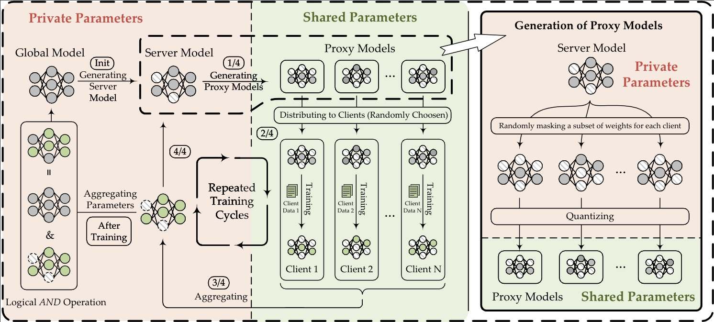

## FedQSN_EMNLP2025
### Abstract
The primary goal of traditional federated learning is to protect data privacy by enabling distributed edge devices to collaboratively train a
shared global model while keeping raw data decentralized at local clients. The rise of large language models (LLMs) has introduced new challenges in distributed systems, as their substan-
tial computational requirements and the need
for specialized expertise raise critical concerns
about protecting intellectual property (IP). This
highlights the need for a federated learning approach that can safeguard both sensitive data
and proprietary models. To tackle this challenge, we propose FedQSN, a federated learning approach that leverages random masking to
obscure a subnetwork of model parameters and
applies quantization to the remaining parameters. Consequently, the server transmits only a
privacy-preserving proxy of the global model to
clients during each communication round, thus
enhancing the model’s confidentiality. Experimental results across various models and tasks
demonstrate that our approach not only maintains strong model performance in federated
learning settings but also achieves enhanced
protection of model parameters compared to
baseline methods.

